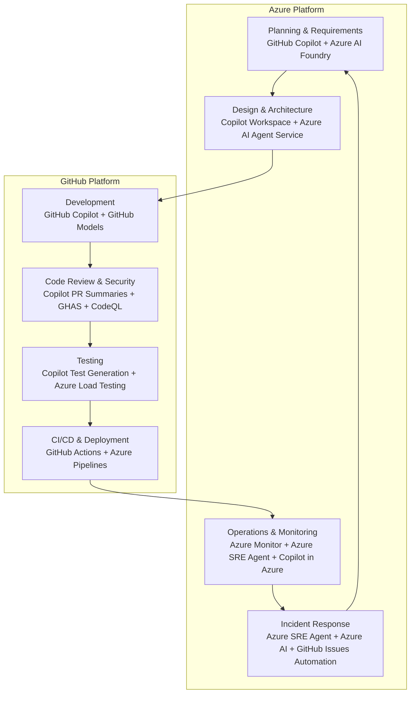

# Agentic and AI-Driven Software Development Lifecycle

This document maps each stage of the traditional Software Development Lifecycle (SDLC) to its agentic and AI-driven equivalent using GitHub and Azure tooling. It provides concrete configuration recommendations for teams who want to move from manual, human-only workflows to AI-augmented and autonomously orchestrated pipelines.

---

## Architecture Overview



**Data flow and operational intent:** AI agents assist or automate tasks at every stage. GitHub Copilot handles developer-facing assistance (code, reviews, tests). Azure AI Foundry and Azure AI Agent Service host autonomous task orchestration and reasoning agents for planning, design, and operations. The loop closes when operational signals from Azure Monitor feed back into GitHub Issues, re-triggering the planning stage with real incident context.

---

## Stage 1 — Planning and Requirements

### Traditional Approach
Project managers write user stories manually, teams hold estimation meetings, and requirements are documented in static tools.

### Agentic Approach

**GitHub tooling:**
- Use **GitHub Copilot** in Issues to draft and refine user stories from a brief description.
- Use **GitHub Projects** with Copilot to auto-populate sprint backlogs and suggest task breakdowns.
- Use **GitHub Discussions** as a threaded context store for AI-assisted decision capture.

**Azure tooling:**
- Deploy an **Azure AI Foundry** project with a reasoning agent (GPT-4o or o-series model) to synthesize business goals into structured epics, user stories, and acceptance criteria.
- Use **Azure AI Agent Service** to build a requirements-gathering agent that queries existing documentation (Retrieval Augmented Generation over your docs corpus using Azure AI Search) and produces gap analysis reports.
- Use **Microsoft Copilot Studio** to build a conversational requirements-capture bot connected to GitHub Issues via Power Automate or Logic Apps.

**Recommended configuration steps:**
1. Enable GitHub Copilot for your organization at `Settings → Copilot → Policies`.
2. Create an Azure AI Foundry project with an AI Search index over your REQUIREMENTS.md and architecture documents.
3. Deploy a Logic App that triggers on new GitHub Issues labeled `needs-spec` and invokes the Foundry agent to produce a draft spec comment on the issue.
4. Configure GitHub Projects automation to move issues to the backlog column when labeled `spec-complete`.

---

## Stage 2 — Design and Architecture

### Traditional Approach
Architects produce diagrams, write ADRs, and circulate for review. Decisions are slow and often undocumented.

### Agentic Approach

**GitHub tooling:**
- Use **GitHub Copilot Chat** in VS Code or the web to generate architecture options from a plain-English brief.
- Store Architecture Decision Records (ADRs) as Markdown files in the repository; use Copilot to draft them from issue context.
- Use **GitHub Copilot Workspace** (where available) to generate an end-to-end plan including file scaffolding from a task description.

**Azure tooling:**
- Use **Azure AI Foundry Prompt Flow** to orchestrate multi-step design evaluation: generate a candidate architecture → validate against Azure Well-Architected Framework pillars → return a structured report.
- Deploy a **Bicep linting and what-if agent** (see the `/bicep-validate-and-whatif` skill in this repository) that evaluates proposed IaC changes before human review.
- Use **Azure AI Agent Service** with tool use to query Azure Advisor and Microsoft Cloud Adoption Framework guidance.

**Recommended configuration steps:**
1. Create a GitHub repository template that includes an `adr/` folder and a root-level `.github/copilot-instructions.md` file that enforces ADR format conventions for all Copilot interactions.
2. Deploy the Bicep validation pipeline using the existing `.github/skills/bicep-validate-and-whatif` skill.
3. Enable the Azure Well-Architected Review API for automated score reports on each architecture PR.

---

## Stage 3 — Development and Code Generation

### Traditional Approach
Developers write code from scratch, consult documentation, and manually look up APIs.

### Agentic Approach

**GitHub tooling:**
- **GitHub Copilot** (IDE extension) provides inline code completions, multi-line generation, and docstring creation.
- **GitHub Copilot Chat** answers codebase-specific questions by indexing the entire repository.
- **GitHub Models** lets developers iterate on prompts and compare model outputs directly from the repository.
- **GitHub Copilot Coding Agent** (Copilot Tasks) assigns implementation tasks autonomously in a sandboxed environment: the agent reads the issue, writes the code, and opens a pull request.
- **Custom Copilot Instructions** (`.github/copilot-instructions.md`) enforce project-specific coding standards, naming conventions, and architecture patterns for every Copilot interaction.

**Azure tooling:**
- Use **Azure OpenAI Service** (via the GitHub Copilot API or direct integration) for self-hosted model deployments where data sovereignty is required.
- Use **Azure AI Foundry** to fine-tune models on your internal codebase, API schemas, or domain-specific patterns.
- Store model API keys and connection strings in **Azure Key Vault**; reference them in GitHub Actions secrets via federated identity.

**Recommended configuration steps:**
1. Add a `.github/copilot-instructions.md` file to the repository describing coding conventions, preferred libraries, and architecture patterns.
2. Enable **Copilot Coding Agent** in GitHub organization settings under `Settings → Copilot → Coding agent`.
3. Configure GitHub Codespaces as the standard development environment with a `devcontainer.json` that pre-installs required tooling and connects to Azure via managed identity.
4. Set up Azure Key Vault RBAC with federated identity for GitHub Actions so no static credentials are stored in repository secrets.

---

## Stage 4 — Code Review and Security

### Traditional Approach
Human reviewers manually assess pull requests; security scans are periodic and disconnected from the review flow.

### Agentic Approach

**GitHub tooling:**
- **GitHub Copilot Pull Request Summaries** auto-generates a plain-English description of what changed and why.
- **GitHub Copilot Code Review** (preview) adds inline AI review comments identifying logic errors, missing tests, and style violations directly on the diff.
- **GitHub Advanced Security (GHAS)** provides:
  - **CodeQL** for static analysis and security vulnerability detection.
  - **Dependabot** for automatic dependency update PRs with vulnerability context.
  - **Secret Scanning** with push protection to block committed credentials.
  - **AI-assisted auto-fix** suggestions for CodeQL and dependency alerts.
- **GitHub Actions** enforces required checks (lint, test, security scan) before merge.

**Azure tooling:**
- Use **Microsoft Defender for DevOps** (integrated into Microsoft Defender for Cloud) to surface GHAS findings alongside Azure resource security posture.
- Use **Azure Policy** and the Defender for Cloud recommendations to enforce that only code from compliant pipelines reaches production infrastructure.

**Recommended configuration steps:**
1. Enable GHAS at the organization level: `Settings → Advanced Security → Enable all`.
2. Configure branch protection on `main`/`prod` to require: Copilot review (when GA), CodeQL scan, and at least one human approval.
3. Enable Dependabot auto-merge for patch-level updates with passing tests.
4. Add a `.github/codeql/codeql-config.yml` to extend default queries with custom security patterns relevant to your codebase.
5. Connect the repository to Microsoft Defender for DevOps via the Azure DevOps connector in Defender for Cloud.

---

## Stage 5 — Testing

### Traditional Approach
QA engineers write test cases manually; test coverage is often incomplete; load tests are run infrequently.

### Agentic Approach

**GitHub tooling:**
- **GitHub Copilot** generates unit, integration, and edge-case tests from function signatures or docstrings directly in the IDE.
- **GitHub Actions** orchestrates test pipelines: unit tests on every push, integration tests on PR merge to staging, load tests on release candidates.
- **GitHub Copilot Workspace** can produce an entire test suite from a task description without manual test authoring.

**Azure tooling:**
- **Azure Load Testing** runs JMeter-based or URL-based load tests at scale; integrate into GitHub Actions to fail a release if latency or error thresholds are exceeded.
- **Azure AI Foundry Evaluation** provides LLM-as-judge evaluation for AI-generated content quality, relevance, and groundedness in applications that include generative AI components.
- **Azure Chaos Studio** runs fault injection experiments (node failures, network latency, pod restarts) against staging environments to validate resilience.

**Recommended configuration steps:**
1. Add a Copilot instruction that requires test files alongside every new module (`.github/copilot-instructions.md`: "Every new function must have a corresponding unit test in the `tests/` directory.").
2. Create a GitHub Actions workflow `load-test.yml` that triggers on `release/**` branches and runs an Azure Load Testing job via `azure/load-testing` action.
3. Schedule a weekly Azure Chaos Studio experiment against the staging environment and post results as a GitHub Issue.
4. Use Azure AI Foundry Evaluation pipelines to score AI-generated responses in any application that exposes an AI feature.

---

## Stage 6 — CI/CD and Deployment

### Traditional Approach
Engineers manually configure pipelines; deployments require manual approvals; environment drift is common.

### Agentic Approach

**GitHub tooling:**
- **GitHub Actions** is the primary CI/CD runtime. Use reusable workflows (`.github/workflows/`) to standardize pipeline stages across repositories.
- **GitHub Environments** with protection rules enforce deployment gates and require named reviewers for production promotions.
- **GitHub Copilot in Actions** (preview) generates and repairs workflow YAML from a natural-language description.
- **Dependabot for Actions** keeps workflow action versions current and secure.

**Azure tooling:**
- **Azure Pipelines** can complement GitHub Actions for enterprise-scale matrix builds or when Azure DevOps integration is required.
- **Azure Container Apps** or **Azure Kubernetes Service (AKS)** host containerized workloads deployed via Actions.
- **Azure Bicep** and **Azure Resource Manager** provide declarative, repeatable IaC deployments; use the `azure/arm-deploy` or `azure/bicep` Actions.
- **Workload Identity Federation (OIDC)** eliminates long-lived credentials: GitHub Actions authenticates to Azure using short-lived tokens via `azure/login`.
- **Azure Deployment Environments** provides self-service, policy-governed environment provisioning for developers without requiring manual infrastructure requests.
- **Azure AI Agent Service** can act as an autonomous deployment orchestrator: receive a deployment request, evaluate risk (query Azure Advisor, check current alerts), approve or escalate, and trigger the GitHub Actions workflow via the API.

**Recommended configuration steps:**
1. Configure Workload Identity Federation between your GitHub repository and an Azure Managed Identity:
   - Create a User-Assigned Managed Identity in Azure.
   - Add a federated credential for `repo:<org>/<repo>:environment:production`.
   - Grant the identity `Contributor` on the target resource group.
   - Use `azure/login@v2` with `client-id`, `tenant-id`, and `subscription-id` (no secrets stored).
2. Define `staging` and `production` GitHub Environments with required reviewers and a deployment wait timer.
3. Set up Azure Deployment Environments linked to the GitHub repository for developer self-service.
4. Add a deployment risk-check step in the pipeline that queries Azure Monitor for active critical alerts before proceeding to production.

```yaml
# Example: OIDC-based Azure login in GitHub Actions
- name: Azure Login
  uses: azure/login@v2
  with:
    client-id: ${{ vars.AZURE_CLIENT_ID }}
    tenant-id: ${{ vars.AZURE_TENANT_ID }}
    subscription-id: ${{ vars.AZURE_SUBSCRIPTION_ID }}
```

---

## Stage 7 — Operations and Monitoring

### Traditional Approach
Operations teams react to alerts; dashboards are manually maintained; runbooks are written once and go stale.

### Agentic Approach

**GitHub tooling:**
- Store runbooks as Markdown in the repository and use **GitHub Copilot Chat** to query them in real time during incidents.
- Use GitHub Actions scheduled workflows to run health checks, housekeeping tasks, and compliance reports.

**Azure tooling:**
- **Azure Monitor** (Log Analytics Workspace, Application Insights, Azure Monitor Agent) provides the observability foundation — already detailed in [TECHNICAL_ARCHITECTURE.md](TECHNICAL_ARCHITECTURE.md).
- **Azure SRE Agent** is a fully managed AI-driven site reliability engineering agent that autonomously monitors Azure resources, correlates telemetry, investigates anomalies, and executes remediation actions. It operates in three configurable autonomy modes:
  - **Read-only:** queries logs, metrics, and topology; surfaces findings to the on-call team.
  - **Review (human-in-the-loop):** proposes a remediation action and waits for engineer approval before executing.
  - **Autonomous:** investigates and remediates without human intervention, within defined RBAC guardrails.
  - Key capabilities:
    - **Data correlation:** automatically queries Azure Monitor, Application Insights, Log Analytics, and resource topology to assemble incident context.
    - **Root cause analysis:** uses LLM reasoning to correlate logs, metrics, and recent deployment changes into validated root cause hypotheses.
    - **Runbook-aware remediation:** learns from past incidents and organizational runbooks, improving resolution quality over time.
    - **ITSM and collaboration integrations:** connects to PagerDuty, ServiceNow, and Microsoft Teams for notification, ticket updates, and shareable investigation threads.
    - **Audit trail:** every action and decision is logged for compliance and postmortem review.
- **Microsoft Copilot in Azure** allows natural-language KQL query generation, resource diagnostics, and cost analysis directly in the Azure portal.
- **Azure Monitor Alerts** with **Azure Logic Apps** or **Azure Functions** can trigger autonomous remediation agents:
  - High CPU alert → agent scales out App Service plan automatically.
  - Failed health probe → agent restarts the container and posts a GitHub Issue.
  - Disk space critical → agent cleans up log archives and posts a summary.
- **Azure AI Agent Service** can host custom operations agents for domain-specific scenarios not covered by Azure SRE Agent.
- **Azure Managed Grafana** dashboards can be version-controlled in the repository and deployed via CI/CD.

**Recommended configuration steps:**
1. Enable **Azure SRE Agent** for your subscription via the Azure portal (`Azure SRE Agent → Create`). Configure the target scope (subscription or resource group), connect to your Log Analytics Workspace, and set the initial autonomy mode to **Review** to build trust before enabling full autonomy.
2. Grant the SRE Agent's managed identity the `Monitoring Reader` and `Log Analytics Reader` roles on the monitored scope, and optionally `Contributor` scoped to the resource group for remediation actions.
3. Connect Azure SRE Agent to your incident management platform (PagerDuty or ServiceNow) and to Microsoft Teams for investigation threads.
4. Enable **Copilot in Azure** for your subscription (preview feature in Azure portal settings).
5. Create an Azure Logic App triggered by Azure Monitor Action Groups that posts structured alert summaries as GitHub Issues labeled `ops-incident`.
6. Store all Grafana dashboard JSON in `grafana/dashboards/` and deploy via the `grafana-dashboard-deploy` step in GitHub Actions on merge to `main`.

---

## Stage 8 — Incident Response and Feedback Loop

### Traditional Approach
Incidents are managed in separate tools; learnings are rarely fed back to the development backlog; postmortems are often skipped.

### Agentic Approach

**GitHub tooling:**
- A GitHub Actions workflow triggered by the `ops-incident` label auto-creates a linked tracking issue with an AI-drafted incident timeline.
- **GitHub Copilot** assists in writing blameless postmortems by summarizing the incident issue thread.
- Root-cause findings are automatically converted to GitHub Issues labeled `reliability-improvement` and placed in the next sprint.

**Azure tooling:**
- **Azure SRE Agent** drives autonomous incident investigation and resolution. When an Azure Monitor alert fires, the agent:
  1. Acknowledges the incident and begins automated data correlation across logs, metrics, topology, and recent deployments.
  2. Forms root cause hypotheses using LLM reasoning and validates each against observability evidence.
  3. Generates a structured investigation summary with links to the relevant queries.
  4. Proposes or executes a remediation action (scale, restart, rollback) depending on the configured autonomy mode.
  5. Posts the investigation thread to Microsoft Teams and updates the ITSM ticket.
  6. Stores a resolution record in its operational memory to improve future responses.
- **Azure Monitor Workbooks** generate post-incident timelines from Log Analytics queries.
- **Azure AI Foundry** hosts a postmortem-drafting agent that ingests alert history, deployment logs, and monitoring data to produce a structured RCA report.
- **Azure Service Health** alerts feed into the same GitHub Issue automation to capture platform-level incidents alongside application incidents.

**Recommended configuration steps:**
1. Create a GitHub Actions workflow `incident-triage.yml` triggered on `issues` labeled `ops-incident`:
   - Calls an Azure OpenAI endpoint with incident context.
   - Posts an AI-drafted RCA template as a comment.
   - Links the issue to the current sprint in GitHub Projects.
2. Configure Azure Service Health alerts to post to the same Logic App webhook that creates `ops-incident` issues.
3. Add a monthly scheduled workflow `postmortem-digest.yml` that queries closed `ops-incident` issues via GitHub API and produces a reliability trend summary.

---

## GitHub.com Configuration for Agentic SDLC

This section provides step-by-step guidance for every GitHub.com setting that enables the agentic SDLC described above. Settings are grouped by scope: organization, repository, and team.

### Organization-Level Settings

All settings below are at `https://github.com/organizations/<org>/settings`.

#### 1. Enable GitHub Copilot

1. Go to `Settings → Copilot → Overview` and click **Enable Copilot**.
2. Under `Settings → Copilot → Policies`:
   - Set **Suggestions matching public code** to `Blocked` for regulated environments.
   - Enable **Copilot in GitHub.com** (web interface completions and chat).
   - Enable **Copilot in the CLI** for terminal-based developer assistance.
3. Under `Settings → Copilot → Access`, assign licenses:
   - Select **All members** (recommended) or assign by team.
4. Under `Settings → Copilot → Coding agent`:
   - Enable **Copilot coding agent** to allow Copilot to autonomously implement GitHub Issues and open pull requests.
   - Set the **Firewall policy** (allowlist of external hosts the coding agent may contact).

#### 2. Enable GitHub Advanced Security (GHAS)

1. Go to `Settings → Advanced Security → GitHub Advanced Security` and click **Enable all**.
2. Under `Settings → Code security → Configurations`, create a new security configuration:
   - Enable **Dependency graph**.
   - Enable **Dependabot alerts** and **Dependabot security updates**.
   - Enable **Dependabot version updates** (auto-PRs for dependency upgrades).
   - Enable **Code scanning** with default setup (CodeQL).
   - Enable **Secret scanning** and turn on **Push protection** (blocks commits that contain secrets).
   - Enable **AI-assisted auto-fix** for code scanning and dependency alerts.
3. Apply the configuration to all repositories (or target specific ones) using `Apply to repositories`.

#### 3. Configure Actions Policies

1. Go to `Settings → Actions → General`:
   - Under **Actions permissions**, select `Allow <org>, and select non-<org>, actions and reusable workflows` (where `<org>` is your GitHub organization name as shown in the GitHub UI) and enable **Allow actions created by GitHub**.
   - Under **Workflow permissions**, set the default to **Read repository contents and packages permissions** (least privilege).
   - Enable **Allow GitHub Actions to create and approve pull requests** only if needed by specific workflows.
2. Go to `Settings → Actions → Runner groups` to create runner groups with appropriate access policies for production deployments.

#### 4. Configure GitHub Models Access

1. Go to `Settings → GitHub Models` and enable access for the organization.
2. Assign access to teams that will use GitHub Models for prompt engineering or evaluation.

#### 5. Configure Audit Log and Webhooks

1. Go to `Settings → Audit log → Streams` and configure streaming to Azure Monitor or a SIEM for compliance.
2. Go to `Settings → Webhooks` and add a webhook to the Azure Logic App endpoint that handles alert-to-issue automation.

---

### Repository-Level Settings

All settings below are at `https://github.com/<org>/<repo>/settings`.

#### 6. Branch Protection Rules (or Rulesets)

Prefer **Rulesets** (the modern successor to branch protection rules) for more flexibility and better inheritance.

1. Go to `Settings → Rules → Rulesets` and click **New ruleset → New branch ruleset**.
2. Set **Target branches** to `main` (and `prod` if applicable).
3. Enable the following rules:
   - **Restrict deletions** — prevent branch deletion.
   - **Require a pull request before merging** — set required approvals to `1` minimum.
   - **Require review from Code Owners** — ensures domain experts review relevant changes.
   - **Require status checks to pass** — add: CodeQL analysis, CI workflow, and any required AI checks.
   - **Require branches to be up to date before merging**.
   - **Block force pushes**.
4. Optionally enable **Require Copilot review** (when generally available) as an additional status check.

#### 7. GitHub Environments

1. Go to `Settings → Environments` and create the following environments:

   **`staging`:**
   - Add **Required reviewers** (optional for staging; set if desired).
   - Set **Deployment branches** to `main`.
   - Add environment secrets/variables: `AZURE_CLIENT_ID`, `AZURE_TENANT_ID`, `AZURE_SUBSCRIPTION_ID` (used with OIDC, not stored as long-lived secrets).

   **`production`:**
   - Add **Required reviewers** (at least 2 named individuals or a team).
   - Set a **Wait timer** (e.g., 10 minutes) to allow cancellation after staging validation.
   - Set **Deployment branches** to `main` only.
   - Add environment variables for production Azure identifiers.
   - Enable **Prevent self-review** so the PR author cannot approve their own production deployment.

#### 8. Copilot Instructions File

1. Create `.github/copilot-instructions.md` in the repository root.
2. Include: project language and framework conventions, preferred library choices, architecture patterns to follow, test file requirements, and any domain-specific context the agent needs.
3. Copilot (IDE, chat, and coding agent) automatically uses this file as persistent context for all interactions in the repository.

#### 9. Custom Copilot Setup Steps (Coding Agent Environment)

1. Create `.github/copilot-setup-steps.yml` to pre-install dependencies and tools in the coding agent's sandbox before it begins work:
   ```yaml
   steps:
     - name: Install dependencies
       run: npm ci   # or pip install -r requirements.txt, dotnet restore, etc.
   ```
2. This ensures the coding agent can run tests and linters to validate its own changes before opening a PR.

#### 10. Issue and PR Templates

1. Create the following templates under `.github/ISSUE_TEMPLATE/`:
   - `bug_report.yml` — structured bug report with environment, steps to reproduce, expected vs. actual behavior.
   - `feature_request.yml` — structured feature request with acceptance criteria (used by the coding agent to scope tasks).
   - `ops_incident.yml` — incident template with severity, impacted service, timeline, and status fields.
   - `reliability_improvement.yml` — post-incident improvement task with root cause link and proposed fix.
2. Create `.github/pull_request_template.md` with: summary, testing notes, deployment checklist, and a link to the related issue.

#### 11. CODEOWNERS

1. Create `.github/CODEOWNERS` to map file paths to responsible teams. Replace `<org>` with your GitHub organization slug:
   ```
   # Infrastructure as Code
   /bicep/   @<org>/platform-team
   # Application source
   /src/     @<org>/app-team
   # Documentation
   *.md      @<org>/architecture-team
   ```
2. CODEOWNERS integrates with branch protection to require targeted reviews and is used by Copilot to suggest reviewers automatically.

#### 12. Dependabot Configuration

1. Create `.github/dependabot.yml`:
   ```yaml
   version: 2
   updates:
     - package-ecosystem: "npm"   # or pip, nuget, docker, github-actions, etc.
       directory: "/"
       schedule:
         interval: "weekly"
       open-pull-requests-limit: 10
     - package-ecosystem: "github-actions"
       directory: "/"
       schedule:
         interval: "weekly"
   ```
2. In repository settings, enable **Dependabot auto-merge** for patch-level updates that pass all required status checks.

---

### Team and Access Settings

#### 13. Teams and Permissions

1. Create GitHub Teams that mirror your operational model:
   - `platform-team` — manages infrastructure, IaC, and pipelines.
   - `app-team` — owns application code and services.
   - `security-team` — reviews security alerts and GHAS findings.
   - `ops-team` — responds to `ops-incident` issues and manages runbooks.
2. Assign teams to repositories with the appropriate permission level (`Write`, `Maintain`, or `Admin`).
3. Configure team-level Copilot access if scoping licenses by team.

#### 14. GitHub Projects Automation

1. Create a GitHub Project (board or table view) for sprint tracking.
2. Configure **built-in automation**:
   - Issues labeled `spec-complete` → move to **Backlog**.
   - PRs merged → move linked issue to **Done**.
   - Issues labeled `ops-incident` → move to **In Progress** sprint column.
   - Issues labeled `reliability-improvement` → add to **Next Sprint**.

---

## Azure Configuration Checklist

| Area | Service | Recommendation |
|------|---------|----------------|
| Identity | Workload Identity Federation | Federated credentials for GitHub Actions; no static secrets |
| Identity | Managed Identity | System-assigned for compute; user-assigned for shared access |
| AI Platform | Azure AI Foundry | Central hub for model deployments, evaluations, and agent hosting |
| AI Agents | Azure AI Agent Service | Host operations, requirements, and deployment orchestration agents |
| Security | Azure Key Vault | All secrets and API keys; RBAC access for Managed Identities |
| Security | Microsoft Defender for Cloud | Enable Defender for DevOps; connect GitHub organization |
| Deployment | Azure Deployment Environments | Self-service dev/test environments from GitHub PRs |
| Operations | Azure SRE Agent | AI-driven incident investigation, root cause analysis, and autonomous remediation; configure autonomy mode (read-only → review → autonomous) and connect to Log Analytics and ITSM |
| Monitoring | Azure Monitor | Log Analytics Workspace, Application Insights, AMA (see [TECHNICAL_ARCHITECTURE.md](TECHNICAL_ARCHITECTURE.md)) |
| Monitoring | Copilot in Azure | Enable for natural-language portal queries and diagnostics |
| Automation | Azure Logic Apps | Alert-to-issue automation; requirements agent triggering |
| Automation | Azure Functions | Lightweight remediation agents and polling tasks |
| Testing | Azure Load Testing | Integrated into GitHub Actions release pipeline |
| Resilience | Azure Chaos Studio | Scheduled fault injection against staging |
| Governance | Azure Policy | Enforce that production resources are deployed only from compliant pipelines |

---

## Tooling Reference Summary

| SDLC Stage | Traditional Tool | Agentic/AI Replacement or Augmentation |
|---|---|---|
| Planning | Spreadsheets, Jira | GitHub Copilot in Issues, Azure AI Foundry requirements agent, Copilot Studio bot |
| Design | Whiteboard, Word docs | Copilot Chat, Copilot Workspace, Azure AI Foundry Prompt Flow, Bicep validation skill |
| Development | Manual coding, Stack Overflow | GitHub Copilot (completions + chat), Copilot Coding Agent, GitHub Models |
| Code Review | Human-only review | Copilot PR Summary, Copilot Code Review, CodeQL AI auto-fix, Dependabot |
| Testing | Manual QA, custom scripts | Copilot test generation, Azure Load Testing, Azure AI Foundry Evaluation, Chaos Studio |
| CI/CD | Manually authored pipelines | Copilot in Actions, OIDC + Azure Deployment Environments, AI-gated deployment agent |
| Operations | Manual dashboards, runbooks | Copilot in Azure, **Azure SRE Agent** (autonomous investigation + remediation), Azure Monitor agent automation |
| Incident Response | Email threads, postmortems | **Azure SRE Agent** (RCA + resolution), AI-drafted postmortems, GitHub Issue automation, Azure Service Health → GitHub integration |

---

## Implementation Roadmap

Work through the stages in order. Each phase is independently valuable and builds on the previous.

1. **Foundation (Week 1–2):** Enable GitHub Copilot organization-wide. Add `.github/copilot-instructions.md`. Configure GHAS (CodeQL + Secret Scanning). Set up Workload Identity Federation between GitHub and Azure.
2. **Developer Experience (Week 3–4):** Enable Copilot Coding Agent. Configure GitHub Codespaces with `devcontainer.json`. Set up GitHub Environments with OIDC-authenticated deployments to Azure.
3. **AI-Assisted Review and Testing (Week 5–6):** Enable Copilot PR Summaries and Code Review. Integrate Azure Load Testing into the release pipeline. Schedule Chaos Studio experiments against staging.
4. **Agent-Driven Operations (Week 7–10):** Deploy Azure AI Foundry project. Enable Azure SRE Agent in Review mode against the staging subscription. Build the alert-to-issue Logic App. Enable Copilot in Azure for the operations team.
5. **Closed-Loop Automation (Week 11–12):** Promote Azure SRE Agent to Autonomous mode for approved remediation actions. Deploy the requirements-gathering Foundry agent. Enable incident-to-backlog GitHub Actions workflow. Configure the postmortem digest workflow. Connect Microsoft Defender for DevOps to Defender for Cloud.

---

## References

- [Technical Architecture](TECHNICAL_ARCHITECTURE.md) — Azure monitoring foundation this SDLC builds on
- [Implementation Plan](IMPLEMENTATION_PLAN.md) — Phased rollout and acceptance criteria for the monitoring platform
- [Alerting and Notification Design](ALERTING_NOTIFICATIONS.md) — Alert catalog and Action Group routing used by operations agents
- [Bicep Deployment Module](bicep/README.md) — IaC assets for the monitoring foundation
