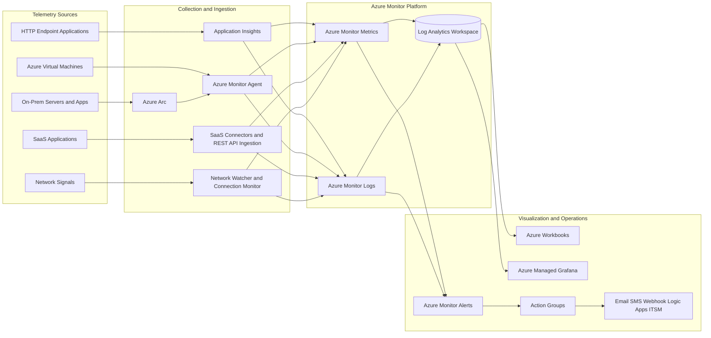

# Architecture Diagram

## Azure Monitoring Hybrid Observability Architecture

## Diagram Notes

- Application and infrastructure telemetry converges into Azure Monitor data stores.
- Log Analytics Workspace is the central analytics layer for KQL queries and correlation.
- Dashboards are provided through Workbooks and Managed Grafana.
- Alerts evaluate metric and log conditions, then route to Action Groups for notifications and integrations.
